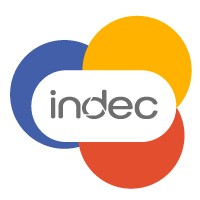
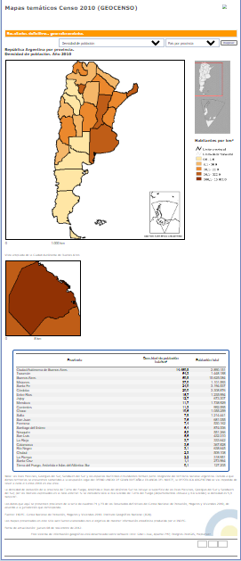
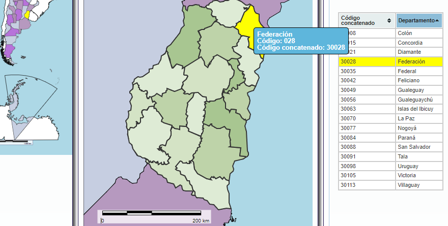
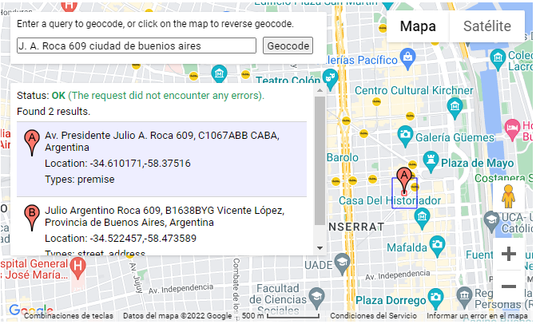
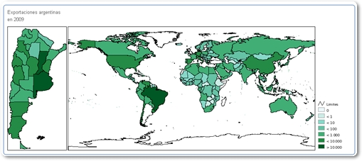
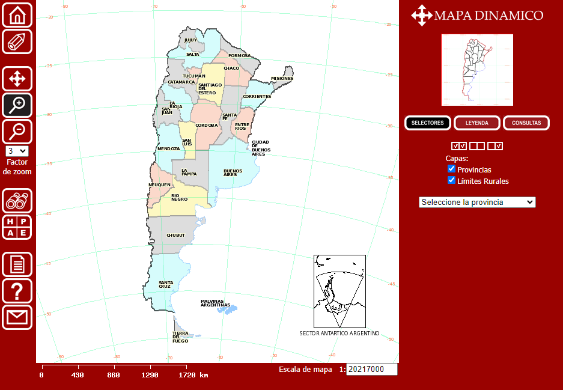

# Lic. Hernán Alperin
Nacido argentino el jueves 13 de febrero de 1969  
DNI 20.606.855  
Matemático y Geoestadístico en la Coordinación del Sistema Geoestadístico  
de la Dirección Nacional de Metodología Estadística - INDEC  

## Objetivos
- aportar desde las Ciencias de la Computación, la Investigación Operativa, la Optimización y la Programación Matemática 
a la metodología de los operativos que se realizan en el Estado Nacional; 
- seguir capacitándome en una posición de liderazgo dentro de un equipo de trabajo productivo; y 
- capacitar a mis colegas del INDEC en el uso de herramientas de Open Source Software.

## Credenciales
-	Investigador en el Institut für Mathematik de la Humboldt Universität-Berlin, Alemania.  2001 - 2004
-	Candidato a Philosophy Doctor en el Operations Research Center, Massachusetts Institute of Technology, EEUU. 1997 - 2000  
-	Licenciado en Ciencias de la Computación, Facultad de Ciencias Exactas y Naturales - Universidad de Buenos Aires. 3 de noviembre de 1994 
- Analista Universitario de Computación, Facultad de Ciencias Exactas y Naturales - Universidad de Buenos Aires. 20 de marzo de 1992  
- Bachiller Nacional, Instituto Manuel Dorrego, 28 de noviembre de 1986

## Contacto

J. A. Roca 609 oficina 701 C1067ABB  
oficina +54-11-4349-9705 interno 49705  
celular 15-9-28382725  
casa +54-11-7524-4828  

## Experiencia

Inicio de actividad laboral según ANSES el 
7 de septiembre de 1988 como docente en el CBC, UBA en la materia Matemática de la cátedra Handsen
 
### INDEC
  

#### Consultor en Matemática, Tecnología de la Información y Geoestadística; y lider en desarrollo de proyectos.  

##### Desarrollo de Sistemas de Información Geoestadística sobre plataforma web y software libre.  

- 2022: Asistencia remota en la coordinación del equipo de referentes provinciales para la segmentación del censo. Dirección de programador Jr. Incorporado en diciembre 2021.  
- 2020 – 2021: Coparticipación en el desarrollo de la interfase para la Segmentación y la carga de la cartografía y listados para el Censo 2022  
- 2018 – 2019: Desarrollo del Core del Segmentador para el Censo de Población 2020 en Open Source Software con herramientas git  
- 2015 - 2017: Miembro de la Coordinación del Sistema Geoestadístico  
- 2009 - 2015: Sistemas de Información Geográfica, Dirección Técnica  
- 2006 - 2009: Mapa Dinámico. Dirección de Informática. Desarrollo de Sistemas de Información Geoestadística sobre Plataforma Web y Software Libre y Abierto 
- 2005 - 2006: Dirección Nacional de Unidades Económicas, Asesor informático de la Dir. de Metodología  

( Entre 1997 y 2005: Estudios y Capacitación en el extranjero, ver más abajo) 

##### Responsable Informático y Consultor en Matemática en EGH e IPC  
- 1994 - 1997: IPC, Consultor en Matemática y Estadística para la resolución de temas relacionados con la metodología; Responsable IT de los sistemas, instalación de la primera red token ring (NOVELL) para el Sistema.  
- 1992 - 1994: EGH, Programador de ajustes metodológicos.  

### Instituto Junín  

  

Operationes y consultor IT   
dic. 2014 - abr. 2015 · 5 meses  
CABA  
Consultor estratégico de plan de negocios y ventas. Desarrollo de sucursales y crecimiento de plataforma web y publicidad.

### Viridis Learning 

  

Recommendation Algorithms and Career-Path Scaffolding  
feb. 2014 - dic. 2014 · 11 meses  
up in the Cloud  
Desarrollo de Algoritmos de Recomendación para la asistencia a estudiante y mano de obra medianamente calificada a elegir la mejor educación con mayor potencial para obtener prospectivos posiciones laborales y ayudarlos a construir su carrera laboral hacia sus objetivos. Este fue implementado usando el estado del arte en Algoritmos Matemáticos y de las Ciencias de Computación, observando la demanda del mercado laboral, la oferta educativa y las inclinaciones profesionales de los usuarios accediendo a las Bases de datos del U.S. Bureau of Labor Statistics and PayScale.com

### Deviget LLC  

 

Programador Matemático  
feb. 2014 - dic. 2014 · 11 meses  
Latin America  
Desarrollo de Algoritmos matemáticos y consultor IT para firmas globales

### Programa Nacional Mapa Educativo, Ministerio de Educación de la Nación

Consultor y Desarrollador GIS  
ago. 2010 - mar. 2013 · 2 años 8 meses  
Paraguay 1657 caba, Argentina  
Análisis, Diseño y Especificación de los Sistemas de Argentina Trabaja, Televisión Digital Abierta de la Comisión Nacional de Telecomunicaciones (tdaCNC). Asesoramiento para la migración de la base de dato del Archivo de la Memoria sobre el Terrorismo de Estado.
Desarrollo de Interfase de geocodificación web usando google-api,
Aplicaciones sobre GNU-Linux, php y PostGIS para la generación asistida de mapas temáticos en estandar svg, y del Portal del Mapa Educativo Nacional en el sitio oficial del Ministerio de Educación.

### INAP, Secretaría de la Gestión Pública, Jefatura de Gabinete de Ministros

Profesor  
nov. 2012 - 2013 · 3 meses  
Av. Roque Saenz Peña (Diag. Norte) 511, caba, Argentina  
Módulo Postgres - PostGIS para el curso de interoperatibilidad GIS para el Grupo de Productores de Información Primaria (GPIP)

### Humboldt University of Berlin

Investigador en la  
Universität zu Berlin  
2001 - 2004 · 3 años 1 mes  
Berlin, Alemania  
Investigación en Optimización Global y Desarrollo del Software LaGO, ver sección Publicaciones.

### Massachusetts Institute of Technology

Asistente de Cátedra y de Investigación,  
ORC - MIT  
1997 - 2001 · 4 años 1 mes  
Cambridge, MA  

#### Asistente de Cátedra (responsable del dictado las clases prácticas, consultas y evaluación de exámenes) en los siguientes cursos para doctorados y maestrías:
- 15.081J Introducción a la Programación Matemática dictado por Dimitris Bertsimas; y 
- 1.961 Redes de Transito, dictado por Ismael Chabini.
- Preparado de material para el programa de educación a distancia de la alianza Singapur - MIT para la materia 5.093 Métodos de Optimization. 

#### Asistente de Investigación en los siguientes proyectos.
- Minimizador de stress de los estudiantes bajo la supervisión de Richard Larson. 
Una aplicación web para el armado del cronograma de exámenes y entregas de prácticas de estudio utilizando herramientas de Programación Matemática.  
- Programación Matemática bajo la supervisión de Dimitris Bertsimas, 
formulación matemática para solucionar problemas con función objetivo del tipo lineal y cuadrático 
con restricciones lineales y variables enteras y continuas usando las condiciones KKT. 
Aplicación para el armado de portfolios de máximo retorno esperado con mínimo riesgo, 
mejor subconjunto de variables de regresión en Big Data usando técnicas de Programación Matemática.  
- Transporte Urbano supervisado por Michel Bierlaire: participación en el desarrollo de sistemas de transporte inteligente 
aplicado a las arterias centrales de Boston. Modelado y simulación del comportamiento de la densidad de tránsito en el proyecto "Big Dig".  

### Facultad de Ciencias Exactas y Naturales, UBA

1989 - 1996 · 7 años  
Jefe de Trabajos Prácticos, Ayudante de 1ra y de 2da  
Facultad de Ciencias Exactas y Naturales, UBA y Ciclo Básico Común  
Ciudad Universitaria  
en las siguientes materias:  
- Matemática, 
- Análisis I del CBC; y   
- Teoría de Lenguajes y Autómatas, 
- Investigación Operativa y 
- Laboratorio II en el Dpto. de Computación, FCEyN

## Proyectos

### Mapas Temáticos del Censo 2010

ene. 2010 - actualidad  
Asociada con INDEC  
Esta aplicación fue completamente desarrollada dentro del Instituto Nacional de Estadística y Censos (INDEC). 
Permite definir fórmulas de cálculo de indicadores a partir de cuadros y 
crear regiones o agrupaciones de unidades geográficas a ser consideradas en forma conjunta. 
Genera en forma intuitiva rangos de clasificación para cada indicador en cada región. 
Con todo esto clasifica usando una escala de color las unidades censales por regiones y se genera mapas temáticos on-line. 
Este sistema permite el trabajo en forma concurrente de distintas areas de la institución.
Se uso exclusivamente Software Libre: GNU/Linux, Apache-PHP, PostGIS-PostgreSQL, Mapserver.

### Distemas de Información e Interoperabilidad del Grupo de Productores de Información Primara (GPIP)
dic. 2014 - 2016
Participación en representación del INDEC, mdelando la información de densidad problacional. Ciudad vs Campo, en proporciones areales, 
a fin de poder establecer un servicio ad-hoc para un sistema de información para las emergencias.
Uso de imágenes satelitales y datos censales a nivel parcial de radios para estimar poblacion y viviendas bajo una zona de influencia..

### Portal del Mapa Educativo Nacional
may. 2013 - 2016   
Asociada con Programa Nacional Mapa Educativo, Ministerio de Educación de la Nación  
Mapa de Navegación Interactiva para ver Información Educativa a Nivel de Nacional, Provincial y Departamental. En este último nivel se muestra la ubicación de las escuelas.

### Unidades Geoestadísticas

ene. 2013 - actualidad  
Asociada con INDEC  
Sistema interactivo que permite consultar los nombres, códigos y ubicación de las distintas unidades geográficas empleadas por el INDEC con fines estadísticos.

### Capacitación en interoperatibilidad GIS para Organismos Públicos

oct. 2012 - dic. 2012  
Asociada con INAP, Secretaría de la Gestión Pública, Jefatura de Gabinete de Ministros  
Proyecto de capacitación para miembros de organismos públicos. Su objetivo esta concentrado en interoperatibilidad, servicios web, data management y desarrollo corporativo de herramientas geoespaciales.

### Geocodificación Múltiple, Automática e Interactiva

jun. 2012   
Asociada con Programa Nacional Mapa Educativo, Ministerio de Educación de la Nación  
Servicio para geocodificar una lista de direcciones en forma asincrónica. Implementación de un cliente para la API de googlemap que permitió scrappear cientos de miles de direcciones, 
corregiendo errores particulares y sistémicos.

### Mapas de Exportaciones Argentina por Origen Provincial

abr. 2010 - actualidad  
Asociada con INDEC, se puede ver en 

[OPEX](https://www.indec.gob.ar/indec/web/Nivel4-Tema-1-16-74)

Sitio web para consultar información sobre exportaciones argentinas desde 1995 
desagregadas por país destino, provincia de origen, año, rubro y producto. 
Se desarrolló usando free and open source software.

### Mapas Dinámicos 1991 - 2001

ene. 2006 - actualidad  
Asociada con INDEC, se puede ver en
 
[Mapas Dinámicos](https://www.indec.gob.ar/indec/web/Nivel4-Tema-1-16-81)

Sistema de Información Geográfica de Argentina con Datos del Censo Nacional de Personas y Viviendas 2001,
 y del Censo Agropecuario 2002. 
Acceso libre vía web. Sistema de Clasificación de Unidades Censales por Indicadores.

## Educación

### Massachusetts Institute of Technology  

Doctorado (PhD), Operations Research: Investigación Operativa  
1997 - 2001 · 4 años   
Actividades y grupos: Teaching and Research Assitant

### Universidad de Buenos Aires  
#### Facultad de Ciencias Exactas y Naturales  

  
  

##### Licenciado, Ciencias de la computación   
1989 - 1994 · 5 años  
Titulación: 8.40 sobre 10 (Diploma de Honor)  
Actividades y grupos: Consejero Directivo por el Claustro Estudiantil  

##### Licenciatura en Ciencias Biológicas, FCEyN, UBA  
Licenciatura, Ciencias Biológicas  
1987 - 1989 · 3 años  
promedio alcanzado: 9.45 sobre 10  
Actividades y grupos: CECEN  
miembro de la agrupación de estudiantes AEI. A cargo del centro de copiado del CECEN.  

## Voluntariado
miembro  
GeoInquietos ArgentinaGeo  
2012 - actualidad · 10 años  
Ciencia y tecnología  
Reuniones mensuales para compartir experiencias en el uso de software libre para Geomática.
Organización de la Conferencia FOSS4G BsAs realizada en abril 2013 y en abril 2016 en el Instituto Geográfico Nacional.  
participación en la organizción de las FOSS4G Argentina

## Recomendaciones
### Luis Piccinali  
Licenciado en Geografía, UBA. Especializado en Sistemas de información geográfica, Bases de Datos Espaciales e Infraestructura de Datos Espaciales.
Luis trabajaba con Hernán en el mismo equipo en 2012 en el programa MapaEducativo del Ministerio de Educación de la Nación
> Hernán posee gran experiencia en el uso y manejo de bases de datos espaciales y en desarrollar consultas complejas (SQL+PostGIS). 
> Sus conocimientos en matemática y habilidad en el tema permiten obtener distintas miradas a la resolución de problemas y a la implementación de proyectos referidos a información geográfica que de por sí son complejos y diversos.

### Lic. Emilio Platzer 
Licenciado en Ciencias de la Computación. Especialista en desarrollo de software y en coordinación de equipos Full Stack
Emilio trabajaba con Hernán en el mismo equipo en 1995 en la Dirección de Precios de Consumo del INDEC
> Hernán es un profesional muy capaz y creativo. 
> Se destaca por ser práctico y llegar a soluciones tempranas aún en situaciones complejas.

### Mg. Juan Carlos Fuchs 
SIG en INDEC (Instituto Nacional de Estadística y Censos) Argentina  
6 de mayo de 2013, Juan Carlos supervisaba directamente a Hernán  
> La participación de H. fue decisiva en la concresión de nuestro proyecto insignia, desarrollado sobre Mapserver, PHP y Postgres. 
> Actualmente lidera el grupo de desarrolladores que trabajan en proyectos SIG utilizando SVG, Javascript, PHP y Postgres con PostGIS. 
> Matemático avezado de participación proactiva con una gran predisposición a guiar y formar a los integrantes de su entorno de trabajo.

### Ing. Carlos Gabriel Asato
Geoscience & Geospatial Information Project and Capability Building, Workgroup Coordination Specialist.
27 de noviembre de 2012, Carlos Gabriel trabajaba con Hernán en el mismo equipo en el Grupo de Productores de Información Primaria (GPIP)
> Hernán es una persona que maneja el Spatial SQL en forma muy clara y eficiente de modo tal que es capaz de generar consultas SQL complejas.

### Dra. Gabriela Mara Ackermann
Coordinadora de Organismos Nacionales  
> Trabajé con Hernán Alperin entre 2009 y 2015, en el desarrollo de aplicaciones para la gestión y publicación de información geoespacial. 
> Hernán fue un recurso clave para el desarrollo de los algoritmos matemáticos aplicados al análisis de datos geoespaciales, así como para el desarrollo de aplicaciones de consultas y visualización de mapas en la web, destacando que todas fueron realizadas con software libre y de código abierto. 
> Varias de estas aplicaciones están vigentes en el portal de INDEC, apartado Territorio.

### Lic. Pablo Delsere
Coordinador del Área de Geoestadística del INDEC de Octubre 2019 a Noviembre 2020
> Trabajo con Hernán desde hace más de diez años; destaco su brillante capacidad para el modelado matemático, el abordaje analítico de problemáticas geoestadísticas, el desarrollo de algoritmos y la codificación de las soluciones. 
> Hernán posee una habilidad notable para imaginar respuestas a problemas geoespaciales complejos desde las matemáticas.
> Tal es el caso del desarrollo del algoritmo de segmentación automática para el Censo Nacional de Población y Viviendas 2022.

### Prof. Adrián Ricardo Toca
Coordinador del Área de Geoestadística del INDEC     
desde 2021 trabajo bajo su supervisión directa   
> El Matemático Alperin es un especialista en el desarrollo de algoritmos para dar respuesta a distintos requerimientos. 
> Hago foco en el algoritmo de segmentación utilizado para distribuir la carga a los censistas para el Censo2022 en todo el país: el mismo está preparado para dar respuesta a complejas situaciones geográficas, dispar conformación de unidades censales, complejas planimetría de las localidades censales y compleja confección de los listados según los distintos tipos de viviendas particulares. 
> El desarrollo cuenta con una alta sofisticación, lo que habla por sí sólo de la gran capacidad analítica, de sistematización de procedimientos y de compromiso con la tarea encomendada del profesional en cuestión. 
> Contar con él en nuestra Coordinación es garantía de calidad en nuestras actividades y producciones.

## Publicaciones
1600 menciones encontradas en academia.edu  
[Academia.edu](https://hu-berlin.academia.edu/HernanAlperin)

### Lagrangian Smoothing Heuristics for Max-Cut 
Journal of Heuristics, 2005  
This paper presents a smoothing heuristic for an NP-hard combinatorial problem. Startingwith a convex Lagrangian relaxation, a pathfollowing method is applied to obtain good solutionswhile gradually transforming the relaxed problem into the original problem formulated with anexact penalty function. Starting points are drawn using different sampling techniques that userandomization and eigenvectors. The dual point that defines the convex relaxation is computedvia eigenvalue optimization using subgradient techniques.The proposed method turns out to be competitive with the most recent ones. The ideapresented here is generic and can be generalized to all box-constrained problems where convexLagrangian relaxation can be applied. Furthermore, to the best of our knowledge, this is thefirst time that a Lagrangian heuristic is combined with pathfollowing techniques.

### LaGO - An object oriented library for solving MINLPs
Global Optimization and Constraint Satisfaction Lecture Notes in Computer Science Volume 2861, 2003, pp 32-42 · 1 oct. 2003
The paper describes a software package called LaGO for solving nonconvex mixed integer nonlinear programs (MINLPs). The main component of LaGO is a convex relaxation which is used for generating solution candidates and computing lower bounds of the optimal value. The relaxation is generated by reformulating the given MINLP as a block-separable problem, and replacing nonconvex functions by convex underestimators. Results on medium size MINLPs are presented.

### A Relaxation-Based Heuristic for the Design of Cost-Effective Energy Conversion Systems
Energy, Volume 31, Issues 10–11, August 2006, Pages 1346–1357 ECOS 2003 · 1 ene. 2003
Mathematicians and engineers have developed in a joint research project a solution approach for performing simultaneous structural and design variable optimization in the design of cost-effective complex energyconversionsystems. The paper presents a methodology and an application to the design of a combined-cycle power plant that provides fixed amounts of electricity and steam for a paper factory. A superstructure that has embedded several potential configurations of such a cogeneration system is used to minimize the total cost of the plant products. The design problem is formulated as a nonconvex mixed-integer nonlinear program (MINLP), and solved via a rounding heuristicbased on an automatically generated convex relaxation of the given problem. Utilities and the process industry are expected to benefit from such a MINLP optimization technique.

## Algunas presentaciones en Congresos

- XVI jornadas IDERA Córdoba 28 de junia al 1 de julio de 2022
- X jornadas IDERA Mendoza, 14 y 15 de Mayo de 2015
- FOSS4G Argentina, IGN, CABA 2013
- VI jornadas IDERA, Tucuman 13 y 14 de Octubre de 2011
- Congreso de Investigación Operativa, Havanna, Cuba 2002
- First International Workshop on Global Constraint Optimization and Constraint Satisfaction, COCOS 2002, Valbonne - Sophia Antipolis, France, October 2002

## Cursos y Materias
### Asociados con MIT (id 965 990 672)
|Fall Term 1997 - 1998 |
| :------------------- |
|Applied Probability 6.431 |
|Introduction to Mathematical Programming 6.251  |
|Traffic Networks 1.961  |

|Spring Term 1997 - 1998  |
| :------------------- |
|Discrete Stochastic Processes 6.262  |
|Nonlinear Programming 15.084  |
|Special Seminars in Applied Probability and Stochastic Processes (Data Mining, Statistics and Optimization) 15.098  |
|Special Seminar in Operations Research (Asymptotic Methods for Stochastic Processes) 15.099 |
| Thesis |

|Fall Term Term 1998 - 1999|
| :------------------- |
|Logistical and Transportation Planning Methods 15.073  |
|Statistical Theory and Methodology 15.076  |

|Spring Term 1998 - 1999  |
| :------------------- |
|Modern Regression and Multivariate Analysis 15.077  |
|Combinatorial Optimization 15.083  |

|Summer Term 1999  |
| :------------------- |
|Operations Research Pre-Thesis Research OR.THP  |

|Fall Term 1999 - 2000  |
| :------------------- |
|Special Seminar in Operations Research 15.099 |
|Thesis OR.THG|

|Spring Term 1999 - 2000|
| :------------------- |
|Special Seminar in Operations Research 15.099 |
|Advanced Managerial Communication 15.281  |
|Thesis OR.THG  |

|Summer Term 2000|  
| :------------------- |
|Thesis OR.THG  |

|Fall Term 2000 - 2001  |
| :------------------- |
|Computational Design I: Theory and Applications 4.201  |
|Thesis OR.THG  |

|Spring Term 2000 - 2001|
| :------------------- |
|Networks for Learning: Regression and Classification 9.520  |
|ESL Advanced Workshop in Writing for Science and Engineering 21F.225   |
|Operations Research Pre-thesis Research OR.THP  |
|Thesis OR.THG, 15.THG  |

24/5/1999 Doctoral General Examination completed    
Graduate Cumulative GPA: 4.9 (on a 5.0 scale)  

### Asociadas con Licenciado en Ciencias de la Computación, FCEyN, UBA
| asignatura                                     | nota  |  fecha  |
|:--                                             |   --: |  ----:  |
|Laboratorio I                                   | 10    |  2/4/90 |
|Laboratorio II                                  |  9    | 21/8/90 |
|Organización del Computador                     |  9    | 21/8/90 |
|Programación de Computadores I                  |  8    | 22/8/90 |
|Algebra I                                       |  9    | 22/2/91 | 
|Análisis II                                     | 10    |  1/3/91 |
|Lógica                                          |  8    |  1/3/91 |
|Programación de Computadores II                 |  6    | 13/3/91 |
|Matemática Discreta                             |  9    | 14/3/91 |
|Laboratorio III                                 |  9    | 26/3/91 |
|Análisis de Sistemas                            |  8    | 30/8/91 |
|Laboratorio IV                                  |  4    | 15/10/91|
|Especificaciones y Diseño de Software           |  7    | 13/12/91|
|Arquitecturas y Sistemas Operativos             | 10    | 13/12/91|
|Probabilidades y Estadística                    |  9    | 18/2/92 |
|Laboratorio V                                   |  6    | 28/2/92 |
|Teoría de Lenguages y Autómatas                 | 10    | 19/3/93 |
|Laboratorio VI                                  |  7    | 20/3/92 |
|Laboratorio VIIA                                |  9    | 13/8/92 |
|Geometría I                                     |  8    | 23/2/93 |
|Inteligencia Artificial                         |  5    |  9/3/93 |
|Bases de Datos                                  |  7    | 18/3/93 |
|Laboratorio VIIIA                               | 10    | 3/6/93  |
|Investigación Operativa                         |  8    | 13/8/93 |
|Cálculo Avanzado                                | 10    | 17/8/93 |
|Seminario sobre Cambio de Creencias y Lógicas no Monótonas              |  8    | 21/10/93|
|Redes de Información                            |  9    | 16/12/93|
|Tesis de Licenciatura: Combinación de Pronósticos en Series de Tiempo   | 10    | 3/11/94 |

### Asociada con Licenciatura en Ciencias Biológicas, FCEyN, UBA
| asignatura                                     | nota  |  fecha  |
|:--                                             |   --: |  ----:  |
|Química General e Inorgánica                    | 10    | 1/3/88  |
|Introducción a la Biología Celular y Molecular  | 10    | 30/9/88 |
|Elementos de Cálculo Numérico                   | TP aprobados   |         |
|Física I                                        | 10    | 25/8/88 |       |
|Física II                                       | TP aprobados   |         |
|Química Orgánica                                | 10    | 27/2/89 |
|Química Biológica                               | 10    | 20/10/89|
|Biometría                                       | 10    | 23/8/89 |
|Introducción a la Botánica                      |  9    | 28/2/89 |
|Ecología General                                |  9    | 21/12/89|
|Genética I                                      |  7    | 21/12/90|
|Microbiología e Inmunología                     |  9    | 22/2/91 |
|Virología                                       | TP aprobados   |         |

### Beca de Investigación para estudiante. 1989
Desarrada 
en INGEBI bajo la supervisión del Dr. Gerardo Glikin y 
en la Fundación Campomar (actual Fundación Instituto Leloir) bajo la supervisión del Dr. Ugalde

## Conocimientos y aptitudes validadas por colegas en LikedIn 

- PostgreSQL, 
Validada por Jonathan Borda y 3 personas más con experiencia en este campo,
24 validaciones
- PostGIS,
Validada por Mauricio Miranda y 2 personas más con experiencia en este campo,
19 validaciones
- Linux, 
Validada por Horacio Arroyo y 1 persona más con experiencia en este campo y 
validada por 2 compañeros de INDEC Argentina,
18 validaciones
- JavaScript,
15 validaciones
- GIS,
13 validaciones
- Web Applications,
11 validaciones
- SQL,
21 validaciones
- PHP 4/5,
Ha superado la evaluación de aptitudes de LinkedIn,
5 validaciones
- Unix Shell Scripting,
5 validaciones
- Joomla
University Teaching
3 validaciones,
- Open Source
11 validaciones,
- Programming
13 validaciones,
- Research
4 validaciones,
- Algorithms
5 validaciones,
- Databases
6 validaciones,
- Computer Science
4 validaciones,
- Modeling
3 validaciones,
- Applied Mathematics
2 validaciones,
- Bash
4 validaciones,
- Spatial Databases
2 validaciones,
- PHP
Ha superado la evaluación de aptitudes de LinkedIn
6 validaciones,
- Interdisciplinary Teaching
1 validación,
- Scientific Writing
2 validaciones,
- Mathematics
3 validaciones,
- Optimizations
2 validaciones,
- Vim
1 validación,
- Mathematical Programming
1 validación,
- Operations Research
2 validaciones,
- Microsoft Excel
1 validación,
- Lotus 123
1 validación,
- Microsoft Word
1 validación,
- Fortran
1 validación,
- DOS
2 validaciones,
- Turbo Pascal
1 validación,
- C++ Language
1 validación,
- Regular Expressions
1 validación,
- svn
2 validaciones,
- jQuery
3 validaciones,
- MapServer
2 validaciones,
- HTML 5,
- English
1 validación,
- Redmine,
- SVG,
1 validación
- Team Management
1 validación,
- Web Development
1 validación,
- Aplicaciones Web
1 validación,
- Desarrollo web
2 validaciones,
- Sistema de información geográfica
2 validaciones.

## Idiomas

### Español 
nativo
### Inglés 
fluente, conversacional a nivel laboral desde 1997
Certificate of Course Completion, from 7/4/96 to 4/5/96 at Oxford ANGLO WORLD EDUCATION (UK) LIMITED

### Alemán 
básico
### Polaco 
elemental

## Hobbies

### Kung-Fu
#### Centro Huo Ma
Cinturón Verde (primer nivel básico) 8/4/2021  
Matías Maximiliano Bayerrri, Director Genral

### Ajedrez
Chess.com

### Caminar y andar en bicicleta
SAMSUNG Health

## Redes sociales

[Facebook](https://www.facebook.com/hernan.alperin.7/)

[Twitter @HernanAlperin](https://twitter.com/HernanAlperin)

[LinkedIn](https://www.linkedin.com/in/hernanalperin/?locale=es_ES)

[Github](https://github.com/hernan-alperin)
